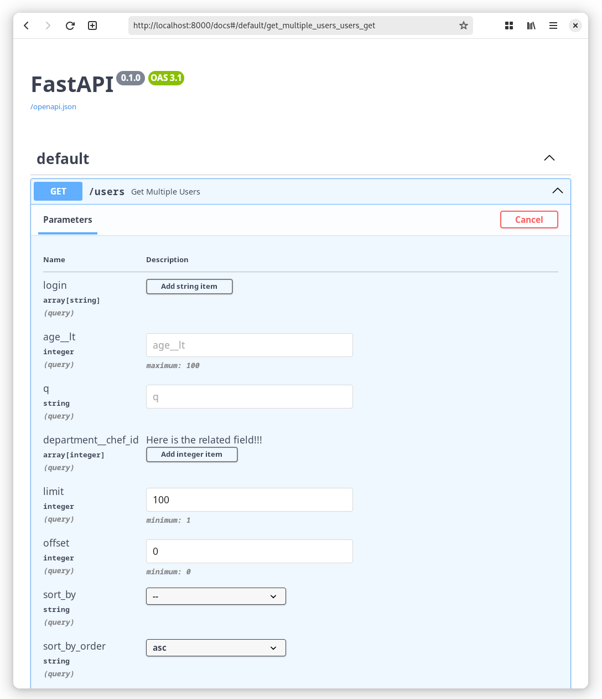

`FastAPI` is a modern and fast web framework for Python.

`pydantic-filters` provides several features for integrations:
[`FilterDepends`][pydantic_filters.plugins.fastapi.FilterDepends], 
[`PaginationDepends`][pydantic_filters.plugins.fastapi.PaginationDepends] and 
[`SortDepends`][pydantic_filters.plugins.fastapi.SortDepends].
Each of the functions unpacks the pydantic model and convert `pydantic.FieldInfo` 
fields to `fastapi.Query`.

## Example

```python
from enum import Enum
from typing import List, Optional

from fastapi import FastAPI
from pydantic_filters import BaseFilter, BaseSort, FilterField, OffsetPagination, SearchField
from pydantic_filters.plugins.fastapi import FilterDepends, PaginationDepends, SortDepends


class DepartmentFilter(BaseFilter):
    chef_id: List[int] = FilterField(description="Here is the related field!!!")


class UserFilter(BaseFilter):
    login: List[str]
    age__lt: int = FilterField(gt=0, le=100)
    q: str = SearchField(target=["login", "name", "email"])
    # Related filter!
    department: DepartmentFilter


class UserSortByEnum(str, Enum):
    id = "id"
    login = "login"
    age = "age"


class UserSort(BaseSort):
    sort_by: Optional[UserSortByEnum] = None


app = FastAPI()


@app.get("/users")
async def get_multiple_users(
    filter_: UserFilter = FilterDepends(UserFilter),
    pagination: OffsetPagination = PaginationDepends(OffsetPagination),
    sort: UserSort = SortDepends(UserSort),
):
    ...
```

!!! Tip
    
    As of [`FastAPI>=0.115`](https://github.com/fastapi/fastapi/releases/tag/0.115.0), 
    the [`PaginationDepends`][pydantic_filters.plugins.fastapi.PaginationDepends] and 
    [`SortDepends`][pydantic_filters.plugins.fastapi.SortDepends] functions can be replaced by 
    `Annotated[PaginationOrSortSchema, fastapi.Query()]`.


